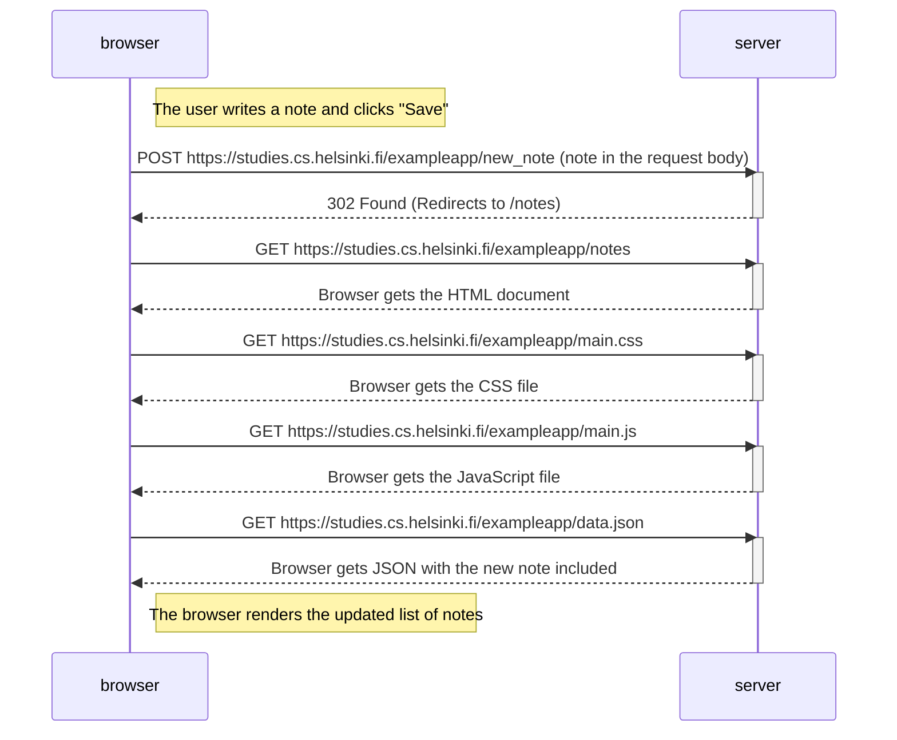

```mermaid
sequenceDiagram
    participant browser
    participant server

    Note right of browser: The user writes a note and clicks "Save"

    browser->>server: POST https://studies.cs.helsinki.fi/exampleapp/new_note (note in the request body)
    activate server
    server-->>browser: 302 Found (Redirects to /notes)
    deactivate server

    browser->>server: GET https://studies.cs.helsinki.fi/exampleapp/notes
    activate server
    server-->>browser: Browser gets the HTML document
    deactivate server

    browser->>server: GET https://studies.cs.helsinki.fi/exampleapp/main.css
    activate server
    server-->>browser: Browser gets the CSS file
    deactivate server

    browser->>server: GET https://studies.cs.helsinki.fi/exampleapp/main.js
    activate server
    server-->>browser: Browser gets the JavaScript file
    deactivate server

    browser->>server: GET https://studies.cs.helsinki.fi/exampleapp/data.json
    activate server
    server-->>browser: Browser gets JSON with the new note included
    deactivate server

    Note right of browser: The browser renders the updated list of notes
```
